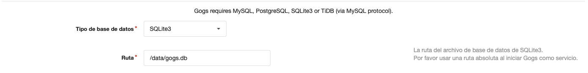
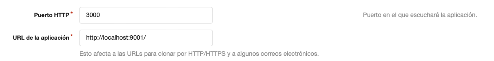
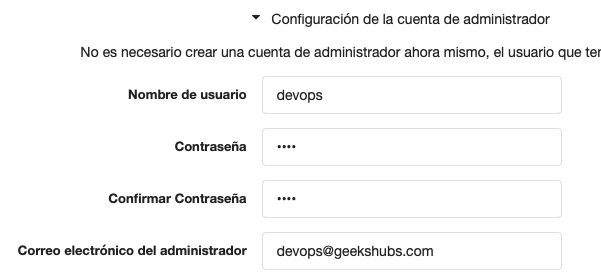

# Configuración del stack.

```
docker-compose -f docker-compose.yml up --build
```

## Gogs

Seleccionar SQLlite como base de datos y utilizar una ruta absoluta:



Configurar URL del servicio:



Configurar cuenta de administrador:



Crear un repositorio para acme-inc.

## Jenkins

Seguir el wizard. (En el output de la consola saldrá el token)
Instalar los plugins `Docker Pipeline` y reiniciar Jenkins.
Añadir un nuevo pipeline de tipo `Multibranch Pipeline` apuntando al repositorio de Gogs mediante HTTP utilizando credenciales.

## Registry

No hay que hacer ningún setup adicional
